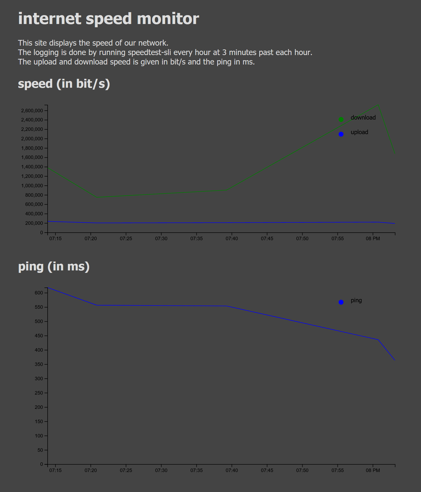

# network_speed_logger
log network speed with speedtest-cli, save as .csv and display on website with javascript library d3.

to setup the loging install speedtest-cli
```
sudo apt-get install speedtest-cli
```
setup log file
```
cd /var/www/html/
sudo mkdir net_speed
sudo chmod 777 net_speed/
speedtest --csv --csv-header > net_speed/speed_log.csv
```
and create cronjob
```
crontab -e
3 * * * * speedtest-cli --csv >> /var/www/html/net_speed/speed_log.csv
```
to make a speedtest every hour 3 minutes past the full hour. \
then add the web page "speed_log_web_page.png" in the appropriate folder for your web server change the path to the "speed_log.csv" file accordingly

below is an example what the website looks like: \

